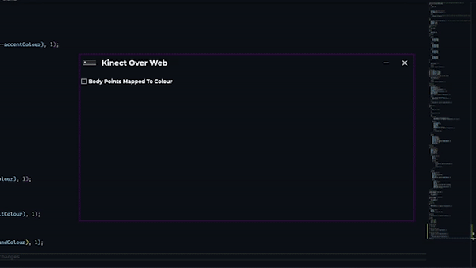
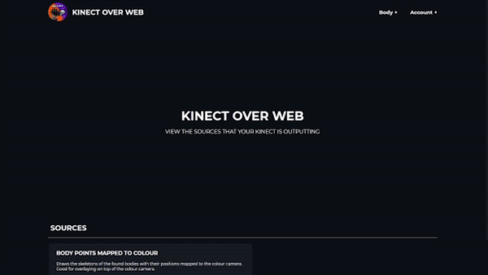

# Kinect-Over-Web
This application sends your Kinect V2 data out over web protocols.

## Installation:
To use this application just download the [latest release](https://github.com/kOFReadie/Kinect-Over-Web/releases/latest/) and run the `KinectOverWeb.exe` application.  
You should see something like this:  

## Overlays:
The app by itself may not be all that useful to the average user so I have created an [overlay webapp](https://readie.global-gaming.co/kinect-over-web/).  
This webapp will allow you to use the outputted data as an overlay for whatever you want.  
Body tracking data example:  
  

In my case I use it as a skeleton overlay for my camera in OBS.  

## Planned changes:
- Add more output sources as it currently only output the body tracking data mapped to the colour camera.
- In the future I would like to reduce the CPU load that this application has on the system, although it isn't all that high I would like it to be lower.
- I would also like to send out the camera feed over a web protocl however this is too taxing on the system to do at the moment.